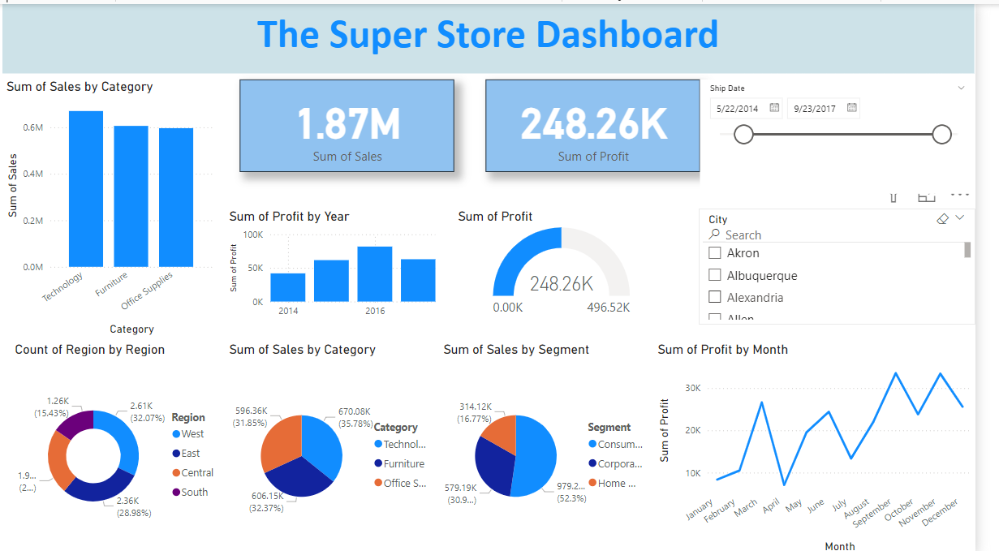

# Super Store Dashboard

## Overview
The **Super Store Dashboard** provides a comprehensive view of sales and profit metrics for a retail store. This dashboard enables users to explore various sales and profit trends across different categories, regions, and segments. It offers valuable insights into business performance through a set of interactive and visually engaging charts.

### Key Features:
1. **Total Sales and Profit**:
   - Displays total sales of **1.87M** and total profit of **248.26K** prominently at the top.
   
2. **Sales by Category**:
   - A bar chart that shows the sum of sales segmented by categories: Technology, Furniture, and Office Supplies.
   
3. **Profit by Year**:
   - A bar chart illustrating the sum of profit from **2014 to 2016**.
   
4. **Count of Region by Region**:
   - A pie chart that represents the distribution of sales across regions: West, East, Central, and South.
   
5. **Sales by Segment**:
   - A pie chart detailing sales distribution among segments: Consumer, Corporate, and Home Office.
   
6. **Profit by Month**:
   - A line chart tracking the sum of profit on a monthly basis, showing trends over the year.
   
7. **Interactive Filters**:
   - Filters for **Ship Date** and **City** allow users to customize the data based on specific parameters.

### Visual Overview
The dashboard helps visualize key performance metrics, making it easy for users to analyze sales and profit trends across various categories, regions, and timeframes.

## Sample Dashboard View


## How to Use the Dashboard
1. **Clone the Repository**:
   ```bash
   git clone https://github.com/yourusername/super-store-dashboard.git
